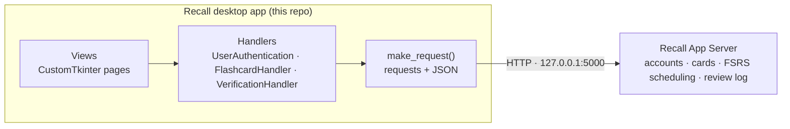

<p align="center">
  
</p>

<p align="center">
  <b>Spaced-repetition flashcards, scheduled by FSRS.</b><br>
  A desktop flashcard app that brings each card back just as you're about to forget it.
</p>

<p align="center">
  <a href="https://github.com/KhushM7/NEA-Recall-Revision-App">App</a> ·
  <a href="https://github.com/KhushM7/Recall-App-Server">Server</a> ·
  <a href="docs/ARCHITECTURE.md">Architecture</a> ·
  <a href="docs/API.md">Server API</a>
</p>

---

Recall is a flashcard app built with Python and [CustomTkinter](https://github.com/TomSchimansky/CustomTkinter). You make sets of cards, review the ones that are due, and rate how well you remembered each one. The [Recall App Server](https://github.com/KhushM7/Recall-App-Server) uses **FSRS** (the Free Spaced Repetition Scheduler) to work out when each card should come back. A dashboard then charts your reviews and your memory of each card.

The app is a desktop client. It stores nothing itself: accounts, cards, review history and scheduling all live on a **local backend server** that it talks to over HTTP at `http://127.0.0.1:5000`.

Recall was built as an A-Level Computer Science NEA project.

<p align="center">
  
</p>

## Contents

- [Features](#features)
- [How scheduling works (FSRS)](#how-scheduling-works-fsrs)
- [Architecture](#architecture)
- [Requirements](#requirements)
- [Getting started](#getting-started)
- [Using Recall](#using-recall)
- [Configuration](#configuration)
- [Project structure](#project-structure)
- [Development](#development)
- [Troubleshooting](#troubleshooting)
- [Related repositories](#related-repositories)
- [License](#license)

## Features

**Accounts**
- Sign up with an email, a username (1–20 characters) and a strong password (at least 8 characters, with upper- and lower-case letters, a number and a special character).
- Log in with **either** your email or your username.
- Reset a forgotten password with a one-time code sent to your email.
- Change your email, username and daily review limit from **Settings** (click your avatar in the top right).

**Reviewing**
- **Scheduled Review:** works through the cards that are due today. Click a card to flip it, then rate it **Again**, **Hard**, **Good** or **Easy**. Each rating goes to the server, which schedules the card's next review.
- **Practice a set:** click any set in your library to run through it with a simple **Correct / Wrong** tally. Practice sessions don't change your schedule.
- **Daily review limit:** caps how many cards a scheduled review can give you in one day.

**Managing cards**
- **Library:** every set with its card count. You can search sets by name, edit a set (add, change or remove cards) or delete it.
- **Create:** add cards one at a time, entering a set name plus the front and back of the card.
- **Import Set:** load a whole set from an Excel file (`.xlsx` / `.xls`). See [Importing from Excel](#importing-from-excel).

**Dashboard**

Six charts, all refreshed each time the home page is shown:

| Chart | What it shows |
|---|---|
| Review Log | Reviews per day for a chosen month and year, plus your busiest day and total review days |
| Current Card States | How your cards split across FSRS states (e.g. New / Review), plus how many times cards have been forgotten (lapses) |
| Future Reviews | How many cards are due on each day of a month, with arrows to move between months |
| Card Stability | Histogram of card stability: the number of days until recall falls to 90% |
| Card Difficulty | Histogram of card difficulty. Greater difficulty slows stability growth |
| Last Card Ratings | The share of each card's most recent rating (Again / Hard / Good / Easy / Not Reviewed) |

## How scheduling works (FSRS)

Spaced repetition means reviewing a card just before you would forget it, rather than on a fixed rota. Cards you know well come back less and less often. Cards you struggle with come back sooner. Your study time goes where it's needed.

Recall uses the [Free Spaced Repetition Scheduler (FSRS)](https://github.com/open-spaced-repetition/fsrs4anki/wiki/The-Algorithm), which tracks three numbers for every card:

| | Meaning |
|---|---|
| **D**ifficulty | How hard the card is for you. Higher difficulty makes stability grow more slowly after each review. |
| **S**tability | How many days it takes for your chance of recalling the card to fall from 100% to 90%. |
| **R**etrievability | Your chance of recalling the card right now. It starts high after a review and decays over time. |

After each review your rating updates D and S, and the card is scheduled for when R is predicted to drop to 90%. A card rated **Good** or **Easy** gains stability, so its next interval is longer. A card rated **Again** counts as a lapse (forgotten) and comes back soon. Over a few reviews, intervals typically stretch from days to weeks to months.

The FSRS calculations run on the server. The app only sends your rating (`POST /submit_rating`) and asks for due cards (`GET /get_due_flashcards`). See [docs/API.md](docs/API.md).

## Architecture



- **Views** (`physics_app/views/`) build each screen and never call the network directly.
- **Handlers** (`physics_app/utilities/server_utilities/`) turn each action into an API call.
- **`make_request`** sends the request and turns any HTTP or connection error into `{"error": "..."}`, so the UI shows a failure state instead of crashing.

See [docs/ARCHITECTURE.md](docs/ARCHITECTURE.md) for page navigation, the module map and design notes.

## Requirements

| | |
|---|---|
| **OS** | Windows 10/11 recommended; development and testing were done on Windows 11. The user menu uses a Windows-only transparent-window attribute, and Excel import needs Microsoft Excel. |
| **Python** | 3.10–3.13 (tested with 3.13). The pinned NumPy 2.2 and Pillow 11.1 don't publish wheels for Python 3.14. |
| **Tkinter** | Included with the python.org installers on Windows. |
| **Server** | A running copy of [Recall App Server](https://github.com/KhushM7/Recall-App-Server) on `127.0.0.1:5000`. |
| **Microsoft Excel** | Only needed for **Import Set**, which reads spreadsheets through [xlwings](https://www.xlwings.org/). |

Python packages (from `requirements.txt`): `customtkinter`, `pillow`, `pytablericons`, `requests`, `xlwings`, `matplotlib`, `numpy`.

## Getting started

### 1. Start the server

Recall can't log in or load cards without its backend. Set up and start the [Recall App Server](https://github.com/KhushM7/Recall-App-Server) by following its README, and leave it running. It must listen on `http://127.0.0.1:5000`. To use a different address, see [Configuration](#configuration).

### 2. Install the app

```powershell
git clone https://github.com/KhushM7/NEA-Recall-Revision-App.git
cd NEA-Recall-Revision-App

py -3.13 -m venv .venv
.venv\Scripts\activate
pip install -r requirements.txt
```

### 3. Run it

From the **repository root**:

```powershell
python -m physics_app.views.main
```

Run it from the root with `-m` because the app loads its images from relative paths (`assets/…`) and imports itself as the `physics_app` package.

> **PyCharm:** set the project interpreter to `.venv`, then create a Python run configuration with **Module name** `physics_app.views.main` and the **working directory** set to the project root.

The window opens full-screen on the **Sign Up** page. Create an account, or click **Already have an account? Log in**.

## Using Recall

### Log in


Enter your email **or** username and your password. Click the eye icon to show or hide the password. **Forgot password?** opens a three-step reset: enter your email, enter the code you're sent, then choose a new password.

### Home and dashboard


The top bar has three buttons: **Your Library**, **Scheduled Review** and **Create**. Your avatar on the right opens **Settings** and **Log Out**. The six dashboard charts are described under [Features](#features). Use the Review Log's month/year menus and the Future Reviews arrows to move through time.

### Review due cards

Click **Scheduled Review**. Each due card shows its front. Click the card to flip it, then choose a rating:

| Rating | Use it when… |
|---|---|
| **Again** | You forgot it. It counts as a lapse and the card comes back soon. |
| **Hard** | You got it, but with real effort. |
| **Good** | You recalled it normally. |
| **Easy** | You knew it instantly. The card gets the longest next interval. |

When no more cards are due you'll see **Review complete.** Close the reviewer with the ✕ button.

### Library


- **Click a set** to practise it (Correct / Wrong, no effect on scheduling).
- **Pencil icon:** edit the set. Change card text, add cards with **+**, delete cards with the bin icon, then **Save**.
- **Bin icon:** delete the whole set.
- **Search:** filters sets by name as you type.

### Create cards


Type a **Set Name**, the **Front** and the **Back**, then click **Save Flashcard**. The front and back boxes clear so you can add the next card to the same set. A set is created automatically the first time you save a card with a new set name.

### Importing from Excel

Click **Create → Import Set**, choose a spreadsheet, check the preview and click **Save**. The file must follow this layout:

- Only the **first sheet** is read.
- Exactly **two columns**: column A is the front and column B is the back.
- **No header row**, **no blank rows** and no extra columns.

| A | B |
|---|---|
| Translate: recordar | To remember |
| Capital of Japan | Tokyo |

The set name defaults to the file name, and you can change it before saving.

## Configuration

| Setting | Where | Notes |
|---|---|---|
| Server address | `SERVER_URL` in `physics_app/utilities/server_utilities/make_request.py` | **This is the address every request actually uses.** The views also pass `"http://127.0.0.1:5000"` into the handlers (e.g. `server_url` in `physics_app/views/main.py`), but `make_request` ignores that value. To move the server, change `SERVER_URL` and update the other copies to match. |
| Daily review limit | In the app: **avatar → Settings** | Stored on the server per user. It must be a positive whole number. |
| Appearance | `ctk.set_appearance_mode("light")` in `sign_up_login_page.py` | The UI is designed for light mode. |
| `config/config.json` | — | Not currently read by the app. |

## Project structure

```text
.
├── assets/
│   ├── recall_logo.png           # full logo (login page)
│   └── memory_recall_icon.png    # icon (home page, top left)
├── config/config.json            # placeholder, not currently used
├── docs/
│   ├── API.md                    # the HTTP contract the app expects from the server
│   ├── ARCHITECTURE.md           # navigation, modules, design notes
│   └── images/                   # README screenshots
├── physics_app/
│   ├── views/                    # one module per screen
│   │   ├── main.py               # entry point: PhysicsApp window + page navigation
│   │   ├── Sign_Up_Login/
│   │   │   ├── sign_up_login_page.py
│   │   │   └── forgot_password_window.py
│   │   ├── home_page.py          # top bar, user menu, settings window
│   │   ├── dashboard_page.py     # the six statistics charts
│   │   ├── flashcard_reviewer.py # scheduled + practice reviewers
│   │   ├── library_page.py
│   │   ├── edit_set_page.py
│   │   ├── create_set_page.py
│   │   ├── import_set_page.py
│   │   └── choose_set_to_review.py
│   └── utilities/
│       ├── server_utilities/     # the only code that talks to the server
│       │   ├── make_request.py
│       │   ├── user_authentication.py
│       │   ├── flashcard_handler.py
│       │   └── verification_handler.py
│       ├── utilities.py          # grid helpers + matplotlib chart builders
│       ├── alert.py              # inline error banner widget
│       ├── tooltip.py            # hover tooltips
│       ├── show_password.py      # password entry with show/hide toggle
│       └── setup_icons.py        # Tabler icons used across the UI
├── requirements.txt
├── .pylintrc
└── LICENSE
```

## Development

- **Formatting:** code is formatted with [Black](https://black.readthedocs.io/) (the PyCharm project runs Black on save).
- **Linting:** `pylint physics_app` uses the repo's `.pylintrc`.
- **Quick check:** there's no automated test suite yet. This catches syntax errors and broken imports without starting the GUI:

  ```powershell
  python -m compileall -q physics_app
  pip install pyflakes
  python -m pyflakes physics_app
  ```

- **Adding a server call:** add an endpoint constant and a method to the relevant handler in `physics_app/utilities/server_utilities/`, go through `make_request`, and document it in [docs/API.md](docs/API.md) so the server repo can implement the same contract.
- **Adding a page:** create a `CTkFrame` subclass in `physics_app/views/` and add a `show_…` method to `PhysicsApp` in `main.py` that calls `show_frame(...)`. See [docs/ARCHITECTURE.md](docs/ARCHITECTURE.md#page-navigation).

## Troubleshooting

| Symptom | Likely cause and fix |
|---|---|
| Login always says **Incorrect Email or Password**, the reviewer says **No flashcards available.**, or dashboard charts are empty | The server isn't reachable. Start the Recall App Server and check that it's on `127.0.0.1:5000`. Network errors are converted to `{"error": ...}` rather than raised, so the app fails quietly. Any HTTP response from `http://127.0.0.1:5000/`, even a 404, means something is listening. |
| `FileNotFoundError: ... assets/recall_logo.png` | You launched from the wrong folder. Run from the repository root. |
| `ModuleNotFoundError: No module named 'physics_app'` | Use `python -m physics_app.views.main` from the repository root, not `python physics_app/views/main.py`. |
| `pip install` fails building NumPy or Pillow | You're on Python 3.14 or newer. Create the virtual environment with Python 3.13. |
| **Import Set** shows "Error reading file" | Excel isn't installed, or the sheet has more than two columns, a header or blank rows. |
| Charts print `UserWarning: Tight layout not applied` | Harmless: a matplotlib warning when a chart panel is very small. |

## Related repositories

- **App (this repo):** https://github.com/KhushM7/NEA-Recall-Revision-App
- **Server:** https://github.com/KhushM7/Recall-App-Server. It handles accounts, flashcard storage, FSRS scheduling and review statistics. Start it before launching the app.

## License

[MIT](LICENSE) © 2024 KhushM7
