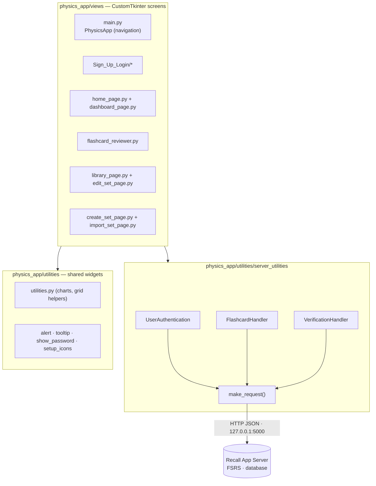
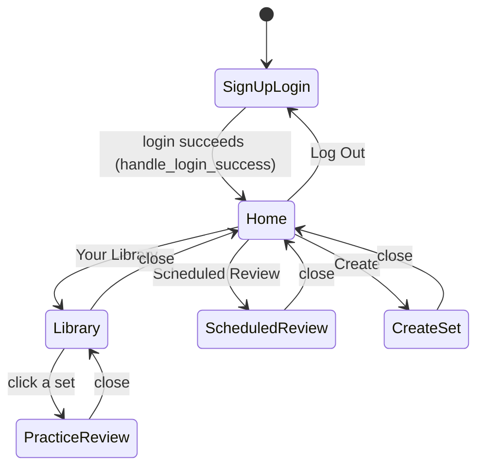
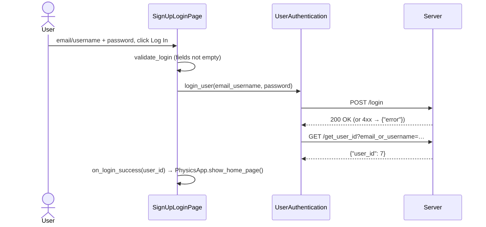
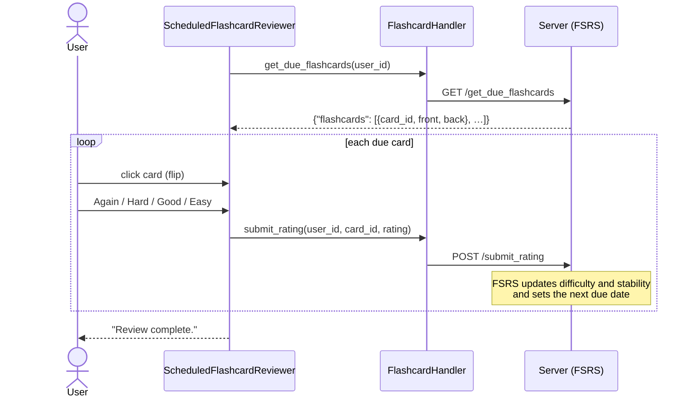

# Architecture

This document explains how the Recall desktop client is put together: the layers, how pages are navigated, what each module does, and the design decisions (and known rough edges) worth knowing before changing the code.

For setup and usage see the [README](../README.md). For the HTTP contract with the server see [API.md](API.md).

## Overview

Recall is a **thin client**. It draws the UI and forwards every action to the [Recall App Server](https://github.com/KhushM7/Recall-App-Server). Nothing is stored locally. Accounts, flashcards, the FSRS scheduling state (difficulty, stability, retrievability, due dates) and the review log all live on the server.

The layers have strict jobs:

| Layer | Responsibility | Never does |
|---|---|---|
| Views | Build widgets, validate input, react to clicks | Talk HTTP |
| Handlers | Map one app action to one endpoint and pick the useful field out of the JSON reply | Touch widgets |
| `make_request` | Send the request and normalise failures to `{"error": "..."}` | Know about specific endpoints |

## Page navigation

`PhysicsApp` (`views/main.py`) is a `tk.Frame` holding one `container`. Only **one page exists at a time**: `show_frame(row, col, FrameClass, *args)` destroys everything in the container and builds the requested page from scratch. Pages don't import each other. Instead, `PhysicsApp` passes each page callbacks (`on_close`, `on_review`, `on_library`, …) that call back into `PhysicsApp`.

Pop-up windows are `CTkToplevel`s opened on top of the current page, so they don't go through `show_frame`:

| Window | Opened from |
|---|---|
| Forgot password | Login → **Forgot password?** |
| Settings | Home → avatar → **Settings** |
| Edit set | Library → pencil icon |
| Import set | Create → **Import Set** |

Because pages are rebuilt every time they're shown, their data is always fresh. For example, the dashboard refetches every chart on each visit (it also refreshes on the Tk `<Visibility>` event).

## Modules

### Views (`physics_app/views/`)

| Module | Class(es) | Notes |
|---|---|---|
| `main.py` | `PhysicsApp`, `main()` | Entry point. Creates the full-screen `CTk` root, owns `user_id` after login and holds all navigation methods. |
| `Sign_Up_Login/sign_up_login_page.py` | `SignUpLoginPage` | Sign-up and log-in forms in one page, switched with `show_frame`. Does client-side validation (email format, username length, password strength), then checks with the server whether the email or username is taken. |
| `Sign_Up_Login/forgot_password_window.py` | `ForgotPasswordManager` | Three frames: send code → verify one-time code → set new password. |
| `home_page.py` | `HomePage` | Top bar buttons, avatar (drawn with Pillow from the username's first letter), the rounded pop-out user menu and the Settings window. Embeds `DashboardPage`. |
| `dashboard_page.py` | `DashboardPage` | 3 × 2 grid of statistics panels. Chart drawing is delegated to `utilities.py`. Histogram bin counts use Sturges' rule. |
| `flashcard_reviewer.py` | `BaseFlashcardReviewer`, `ScheduledFlashcardReviewer`, `UnscheduledFlashcardReviewer` | The base class owns the card, flip logic and navigation. The scheduled subclass adds Again/Hard/Good/Easy buttons, each of which calls `submit_rating`. The unscheduled (practice) subclass only counts Correct/Wrong locally. |
| `library_page.py` | `LibraryPage` | Lists sets with card counts, live search, and edit and delete actions. `save_set_callback` turns the edit window's result into update, create and delete calls. |
| `edit_set_page.py` | `EditSetWindow` | Editable list of a set's cards. It returns `(set_name, updated_cards, deleted_card_ids)` through a callback rather than calling the server itself. |
| `create_set_page.py` | `CreateSetPage` | Single-card entry form. |
| `import_set_page.py` | `ImportSetPage` | Reads the first sheet of an Excel file through xlwings, previews it, then creates one card per row. |
| `choose_set_to_review.py` | `ChooseSetToReview` | Small modal set picker. It isn't currently used by the navigation flow. |

### Handlers (`physics_app/utilities/server_utilities/`)

| Module | Wraps |
|---|---|
| `make_request.py` | `requests.request(...)` with JSON body/params. It raises on HTTP errors internally and returns `{"error": str}` instead of raising. |
| `user_authentication.py` | Register, log in, availability checks, look up ID/username/email, update email/username/password. |
| `flashcard_handler.py` | Due cards, cards by set, sets, ratings, create/update/delete, all dashboard statistics and the daily review limit. |
| `verification_handler.py` | Send and verify one-time email codes. |

The full list of endpoints, their parameters and expected replies is in [API.md](API.md).

### Shared UI (`physics_app/utilities/`)

| Module | Provides |
|---|---|
| `utilities.py` | `configure_grid`, `resize_and_update_image` (logo scaling) and the matplotlib chart builders `plot_histogram`, `plot_calendar_bar_graph` and `plot_pie_chart`, embedded with `FigureCanvasTkAgg`. |
| `alert.py` | `Alert`: an inline, hideable error banner. |
| `tooltip.py` | `Tooltip`: a hover tooltip with a configurable delay. |
| `show_password.py` | `PasswordEntry`: an entry field with an eye-icon show/hide toggle. |
| `setup_icons.py` | Loads [Tabler icons](https://tabler.io/icons) through `pytablericons` as `CTkImage`s. |

## Key flows

### Logging in

### A scheduled review

The due list is fetched **once** when the reviewer opens. Rating a card moves to the next item in that list. A card rated **Again** comes back when its new due date arrives, which may be in a later session.

## Design notes and known rough edges

These are worth knowing before you extend the code:

- **One server address is actually used.** `make_request` always uses its own `SERVER_URL` constant. The `server_url` arguments passed to the handlers (and hard-coded in several views) are stored but not used for requests. Changing the server address therefore means editing `make_request.py`. A single config value (for example from `config/config.json`) would be a natural clean-up.
- **Errors are swallowed.** Because `make_request` returns `{"error": ...}` instead of raising, callers see "not found / empty" rather than "server down". Login shows *Incorrect Email or Password*, and the reviewer shows *No flashcards available.* The dashboard assumes dictionaries, so with no server some panels may log a traceback to the console instead of drawing.
- **Relative asset paths.** Images are opened as `assets/...` relative to the current working directory, so the app must be started from the repository root.
- **Library card counts cost one request per set.** `get_set_names_with_num_terms` calls `/get_flashcards_by_set` once for each set, so a large library means many requests. A server endpoint returning the counts directly would remove this.
- **`FlashcardHandler.update_set`** passes three arguments to `update_flashcard(user_id, flashcard)`, which takes two. Nothing calls it today (editing goes through `LibraryPage.save_set_callback`), but fix it before using it.
- **Windows-specific touches.** The user menu uses `wm_attributes("-transparentcolor", ...)`, and Excel import relies on xlwings driving a local Excel install.
- **Package name.** The Python package is still called `physics_app` for historical reasons. Renaming it would mean updating every `from physics_app...` import and the run command.
